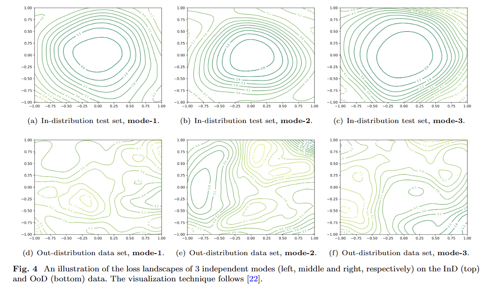

# ood-mode-ensemble

PyTorch implementation of the IJCV paper *Revisiting Deep Ensemble for Out-of-Distribution Detection: A Loss Landscape Perspective*. [journal](https://doi.org/10.1007/s11263-024-02156-x), [arxiv](https://arxiv.org/abs/2310.14227).

If our work is helpful for your research, welcome to cite our paper!

```
@Article{Fang2024,
author={Fang, Kun
and Tao, Qinghua
and Huang, Xiaolin
and Yang, Jie},
title={Revisiting Deep Ensemble for Out-of-Distribution Detection: A Loss Landscape Perspective},
journal={International Journal of Computer Vision},
year={2024},
month={Dec},
day={01},
volume={132},
number={12},
pages={6107-6126},
issn={1573-1405},
doi={10.1007/s11263-024-02156-x},
url={https://doi.org/10.1007/s11263-024-02156-x}
}
```


## Introduction
Our work is summarized as follows:
- Models trained independently w.r.t different random seeds converge to **isolated modes**.
- These independent modes, which all reach low-loss regions with in-distribution data, yet yield significantly different loss landscapes with out-distribution data, which further suggests **significantly fluctuating OoD detection performance across independent modes** and has long been ignored by the research community.
- Motivated by such diversities on OoD loss landscape across modes, we revisit the deep ensemble method for OoD detection through **mode ensemble**, and design corresponding ensemble strategies for different types of OoD detectors, leading to improved performance and benefiting the OoD detector with reduced variances.

<a href="pics/mode-loss-landscape-ood.png"><div align="center"></div></a>

The following table appears as an example to show the high FPR variances across modes and the improved performance of mode ensemble, where the [RankFeat](https://proceedings.neurips.cc/paper_files/paper/2022/file/71c9eb0913e6c7fda3afd69c914b1a0c-Paper-Conference.pdf) detector is executed on 5 independent modes (DN121-ImageNet).

modes    | iNaturalist | SUN     | Places  | Texture
:-:      | :-:         | :-:     | :-:     | :-:
mode-1   | 66.01       | $\underline{75.53}$ | $\underline{79.95}$ | 43.60
mode-2   | 58.49       | $\underline{34.70}$ | $\underline{50.70}$ | 32.73
mode-3   | 59.53       | 50.07   | 63.27   | 40.64
mode-4   | $\underline{84.70}$     | 69.57   | 76.45   | $\underline{49.89}$
mode-5   | $\underline{46.58}$     | 44.46   | 58.95   | $\underline{22.48}$
ensemble | **39.32**   | 39.48   | 55.61   | **15.98**

## Overview of this repository

A description on the files contained in this repository.

### Training
1. `train_c10.py`: training isolated modes w.r.t different random seeds on CIFAR10
2. `train_imgnet.py`: training isolated modes w.r.t different random seeds on ImageNet

### Evaluation
1. `eval_clean.py` and `eval_clean_ensemble.py`: evaluation the clean accracy of single modes and ensembling modes, respectively
2. `eval_ood.py` and `eval_ood_ensemble.py`: evaluation the OoD detection performance of single modes and ensembling modes, respectively

### Others
1. `utils_ood.py`: A collection on the utility functions of OoD detectors
2. `utils.py`: Utility functions
3. `utils_knn/`: Utility functions on the kNN method
4. `utils_mahalanobis/`: Utility functions on the Mahalanobis method

## Getting started
Install dependencies
```
conda create -n ood python=3.8
conda activate ood
conda install pytorch torchvision cudatoolkit=11.3 -c pytorch # for Linux
pip install pandas, scipy, scikit-learn, tensorboard
pip install statsmodels
```
Install [faiss](https://github.com/facebookresearch/faiss/tree/main) package following its [docs](https://github.com/facebookresearch/faiss/blob/main/INSTALL.md).

### dataset preparation
- InD datasets are the CIFAR10 and ImageNet-1K, respectively.
- OoD datasets are based on the [KNN](https://github.com/deeplearning-wisc/knn-ood) method. Follow the intructions in [KNN](https://github.com/deeplearning-wisc/knn-ood) to prepare the OoD datasets.

A full collection of all the training and evaluation commands can be found in [EXPERIMENTS.md](./EXPERIMENTS.md).

## Released trained-models

Our models trained w.r.t different random seeds, including R18-C10, WRN28X10-C10, R50-ImgNet, DN121-ImgNet and T2T-ViT-14-ImgNet, are released [here](https://drive.google.com/drive/folders/123fa0dEG-t0qyLjIEgevCyoSvGFQ0iyt?usp=sharing).

Download these models and put them in `./save/` as follows
```
ood-mode-ensemble
├── model
├── utils_knn
├── utils_mahalanobis
├── save
|   ├── CIFAR10
|   |   ├── R18
|   |   └── WRN28X10
|   |       ├── seed-1000
|   |       |   └── epoch150.pth
|   |       ├── ...
|   |       └── seed-2400
|   └── ImageNet
|       ├── DN121
|       |   ├── seed-1000
|       |   |   └──checkpoint.pth.tar
|       |   ├── seed-2000
|       |   ├── ...
|       |   └── seed-5000
|       ├── R50
|       └── t2tvit 
├── ...
```

## Additional references
The loss landscape visualization techniques follow [mode-connectivity](https://github.com/timgaripov/dnn-mode-connectivity) and [loss-surface](https://github.com/tomgoldstein/loss-landscape).

## 

If u have problems about the code or paper, u could contact me (fanghenshao@sjtu.edu.cn) or raise issues here.

If the code benefits ur researches, welcome to fork and star ⭐ this repo! :)
